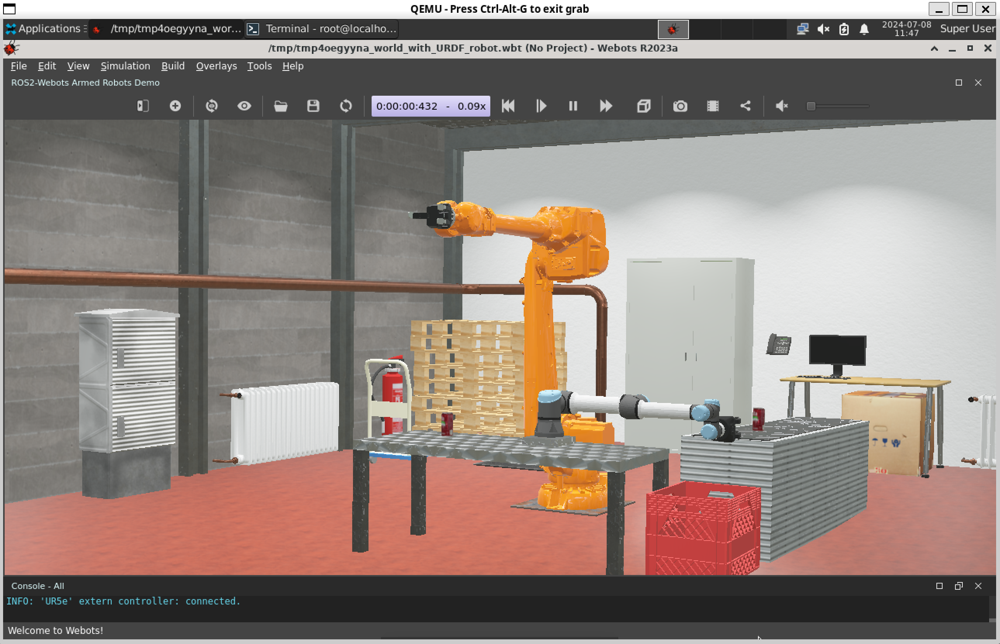
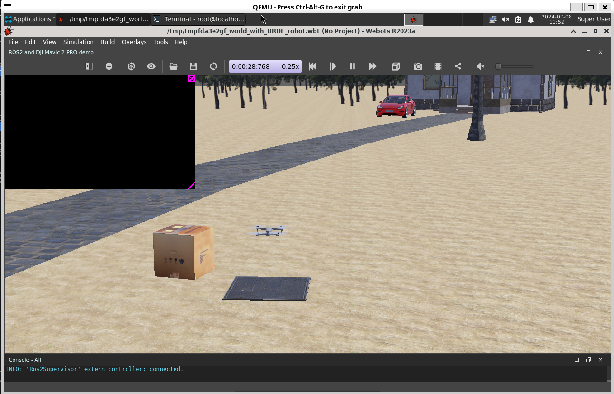

# Webots 在 openEuler 系统下的支持度及移植调查
[参考资料](https://github.com/cyberbotics/webots_ros2/wiki)

## Webots 简介
[官网](https://cyberbotics.com/)  [仓库](https://github.com/cyberbotics/webots) [文档](https://cyberbotics.com/doc/guide/menu) 

Webots 是一款免费，开源的 3D 机器人模拟软件，可以模拟各种机器人，包括两轮机器人、工业手臂、腿式机器人、模块化机器人、汽车、无人机、自主水下航行器、履带式机器人、航空航天器等。  
Webots 核心基于现代 GUI 框架 Qt、物理引擎 (ODE fork) 和 OpenGL 3.3 渲染引擎 (wren) 的组合。它可以在 Windows、Linux 和 macOS 上运行。

## x86_64 原生构建及打包
[参考资料](https://github.com/cyberbotics/webots/wiki/Linux-installation/)
### 下载源码
```bash
git clone --recurse-submodules -j8 https://github.com/cyberbotics/webots.git
cd ./webots
```
### 依赖安装
```bash
dnf install Xvfb openeuler-lsb cmake swig mesa-libGL glib2 freeimage freetype-devel libxml2-devel boost-devel libssh-devel libzip readline pbzip2 wget zip unzip
```
### 构建
这一步需要良好的网络环境
```bash
make -j8
```
构建完成后直接运行项目目录下的 `webots` sh脚本即可，需要在桌面环境下运行。

### 打包成 rpm
TODO

## 测试运行
已经根据 [环境配置](https://github.com/CubeSugarCheese/plct-report/blob/main/2-openEuler-ROS2-Humble-test.md) 配置好了 openEuler ROS2 Humble

### 运行 Demo 测试
```bash
ros2 launch webots_ros2_universal_robot multirobot_launch.py
```


```bash
ros2 launch webots_ros2_mavic robot_launch.py
```


### 初步测试结论
Webots 可以在 openEuler x86_64 上正常运行，但由于虚拟机性能不够，软件运行卡顿，难以进一步测试，考虑使用物理机进行测试